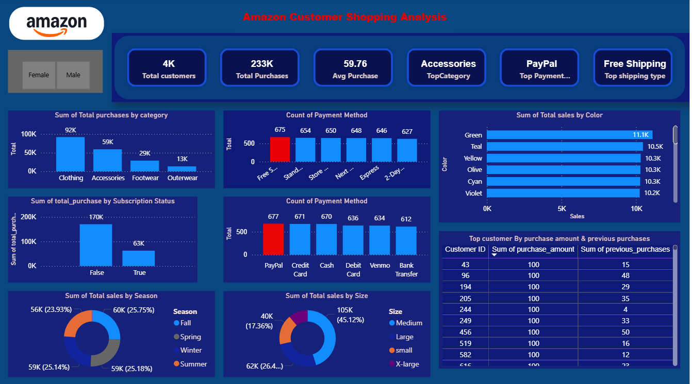

# Amazon Customer Shopping Analysis

# 📊 Dashboard Preview

## 1. Project Overview
This project analyzes Amazon customer shopping behavior to understand purchase trends, customer preferences, and payment patterns. By combining SQL for data cleaning & data extraction and Power BI for visualization, the project provides actionable insights to help improve business decision-making and marketing strategies.

## 2. Objective
The objective of this project is to **analyze customer shopping behavior** and provide **actionable insights** to support business decision-making. The analysis focuses on three main areas:  
- **Purchase Trends:** Identify top-selling categories, popular sizes, and seasonal patterns.  
- **Customer Segmentation:** Analyze purchasing patterns based on subscription status, payment methods, and demographics.  
- **Marketing Opportunities:** Recommend strategies for promotions, loyalty programs, and inventory management.

## 3. Dataset
- **Source:** Kaggle  
- **Rows:** 4,000  
- **Columns:** 17  
- **Description:** Contains customershopping records and transaction information.  

## 4. Tools & Technologies
- **Data Import:** Excel (Kaggle dataset)  
- **Data Cleaning:** SQL + Power BI 
- **Analysis:** SQL (queries and aggregations)  
- **Data Transformation / Modelling / Visualisation:** Power BI

## 5. Dataset - 
<a href="https://github.com/Krishbelwal/Amazon_Customer_Analysis/blob/main/Dataset.csv">Dataset</a>

## 6. Key Insights
- **Top Categories:** Clothing is the most purchased category (92K purchases), followed by Accessories (59K), Footwear (29K), and Outerwear (13K).  
- **Subscription Status:** Customers without subscriptions purchased more (170K) compared to subscription users (63K).  
- **Payment Method:** PayPal is the most used payment method, followed by Credit Card, Cash, and Debit Card.  
- **Sales by Season:** Peak sales are almost equally distributed across Spring, Summer, Fall, and Winter (~25% each).  
- **Sales by Size:** Medium size is the most popular (45.12%), followed by Large (26.4%), Small (17.36%), and X-Large.  
- **Sales by Color:** Green, Teal, Yellow, Olive, Cyan, and Violet are the top-selling colors (~10–11K sales each).  

## 7. Recommendations
- Focus promotions on high-selling categories like Clothing and Accessories.  
- Offer loyalty programs or incentives for subscription users to increase repeat purchases.  
- Ensure inventory is optimized for popular sizes (Medium & Large) and top-selling colors.  
- Highlight peak seasonal periods in marketing campaigns to maximize sales.  
- Provide flexible payment options like PayPal and Credit Card to encourage conversions.  

## 8. Dashboard Preview
<a href="https://github.com/Krishbelwal/Amazon_Customer_Analysis/blob/main/Project_Dashboard.png">View Dashboard</a>

## 9. Folder Structure
Dataset.csv - Raw dataset
project_objective.txt - Project objective details
Data_cleaning.sql - SQL scripts for data cleaning
Analysis.sql - SQL queries for analysis
views.sql - SQL views created for Power BI import
Project_Dashboard.png - Screenshot of final dashboard

## 10. How to Use -
1. Open the `Dataset.csv` to see the dataset.
2. Open the `Project_objective` to see the business problems. 
3. Open the `Data_cleaning` script in your SQL environment to clean the dataset.  
4. Run `Analysis.sql` and `views.sql` to prepare aggregated tables and views for visualization.  
5. Import the processed data into Power BI for creating dashboards and visualizations.  
6. Explore insights from interactive visuals and refer to recommendations for business decisions.

## 11. Project Workflow / Process
1. **Data Import:** Imported Excel dataset into SQL for structured processing.  
2. **Data Cleaning:** Cleaning data in SQL.  
3. **Analysis:** Wrote SQL queries for top categories, payment methods, subscription analysis, seasonal sales, sizes, and colors.  
4. **Views Creation:** Created SQL views for simplified Power BI import.  
5. **Power BI Import:** Imported SQL views into Power BI.  
   **Basic Cleaning in Power BI:** Renamed columns, adjusted data types, applied DAX measures for calculations.  
7. **Dashboard Development:** Built interactive dashboards with charts, tables, slicers, and KPIs.  
8. **Insights and Recommendation:** Derived key findings and formulated recommendations based on dashboard analysis.  

